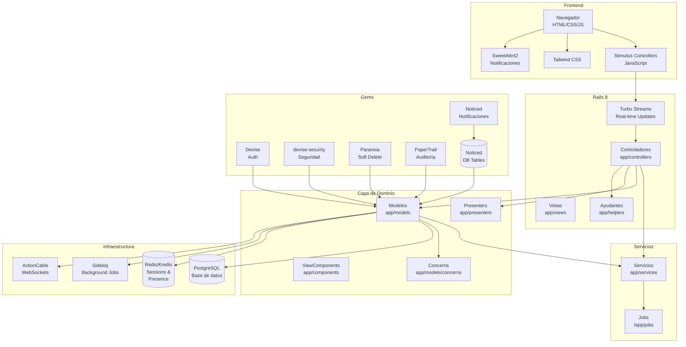
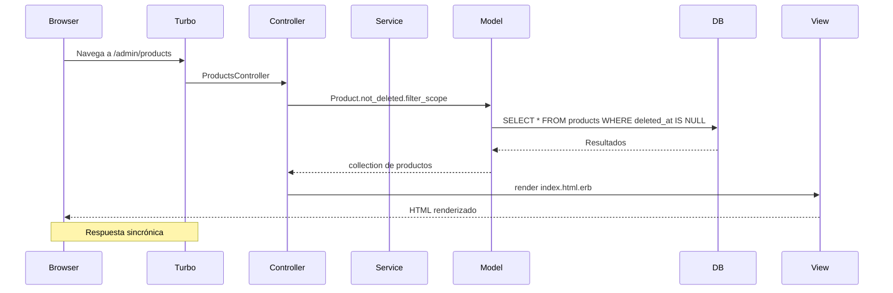
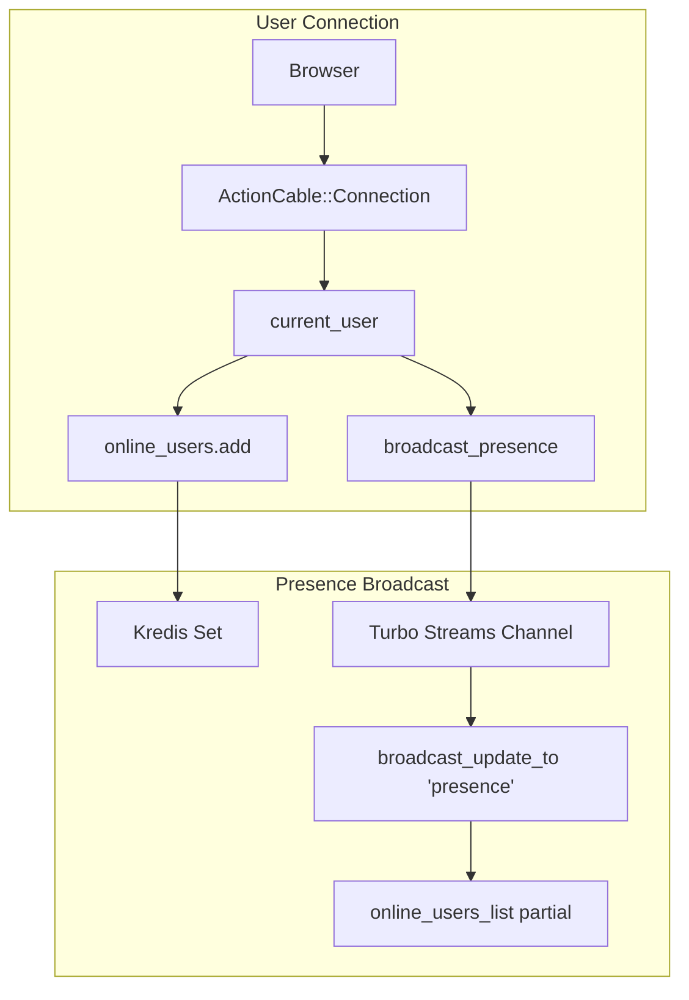
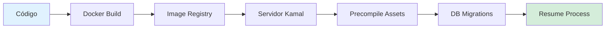

# Arquitectura del Sistema

Esta documentación describe la arquitectura técnica de NEXO POS.

---

## 🏗️ Diagrama de Arquitectura



---

## 🧱 Arquitectura por Capas

### Capa de Presentación (Views & Controllers)

**Responsabilidad:** Manejo de la interfaz de usuario y routing

- **Layouts**: `app/views/layouts/`
  - `application.html.erb` - Layout principal
  - `admin_dashboard.html.erb` - Panel de administración
  - `authentication.html.erb` - Página de login

- **Shared Views**: `app/views/admin/shared/`
  - `_sidebar.html.erb` - Navegación principal
  - `_topbar.html.erb` - Barra superior
  - `_breadcrumbs.html.erb` - Navegación por migas
  - `_flash.html.erb` - Mensajes flash

- **Controllers**: `app/controllers/`
  - `ApplicationController` - Base con `set_locale`, `current_language`
  - `Admin::ProductsController` - Gestión de productos
  - `Admin::CategoriesController` - Gestión de categorías
  - `Admin::LanguagesController` - Gestión de idiomas
  - `Admin::DashboardController` - Dashboard del admin

---

### Capa de Modelo (Models)

**Responsabilidad:** Lógica de negocio y persistencia

#### Modelos Principales

| Modelo | Tabla | Descripción |
|--------|-------|-------------|
| `User` | `users` | Usuario con Devise, roles y preferencias |
| `Product` | `products` | Productos del catálogo (soft delete) |
| `Category` | `categories` | Categorías de productos |
| `Language` | `languages` | Configuración multi-idioma |
| `SystemRole` | `system_roles` | Roles del sistema (system/branch) |
| `UserRole` | `user_roles` | Asociación User-Role con Branch |
| `Branch` | `branches` | Sucursales |
| `DashboardPreference` | `dashboard_preferences` | Configuración widgets dashboard |
| `Conversation` | `conversations` | Conversaciones de chat |
| `Message` | `messages` | Mensajes del chat |

#### Modelos SAT (México)

| Modelo | Tabla | Descripción |
|--------|-------|-------------|
| `SatTax` | `sat_taxes` | Impuestos SAT (IVA, IEPS, etc.) |
| `SatUnitKey` | `sat_unit_keys` | Claves de unidad SAT |
| `SatBank` | `sat_banks` | Bancos SAT |
| `SatCurrency` | `sat_currencies` | Monedas SAT |
| `SatFiscalRegime` | `sat_fiscal_regimes` | Regímenes fiscales |
| `SatPaymentMethod` | `sat_payment_methods` | Métodos de pago SAT |
| `SatPaymentMethodType` | `sat_payment_method_types` | Tipos de pago SAT |
| `SatMonth` | `sat_months` | Meses SAT |

---

### Capa de Servicios (Services)

**Responsabilidad:** Lógica de negocio compleja

```ruby
# app/services/address_geocoding_service.rb
AddressGeocodingService.new(address_id).call
```

- `AddressGeocodingService` - Geocodificación de direcciones con Mapbox
- `Geocoding::GeocodePostalCodeService` - Servicio para código postal
- `Geocoding::MapboxValidateAddressService` - Validación con Mapbox

---

### Capa de Trabajo por Fondo (Jobs)

**Responsabilidad:** Procesos asíncronos

```ruby
# app/jobs/geocode_address_job.rb
GeocodeAddressJob.perform_later(address.id)
```

- `GeocodeAddressJob` - Geocodificación en background
- `ApplicationJob` - Base con ActiveJob

---

## 🔄 Flujo de una Petición HTTP



---

## 🔐 Flujo de Autenticación

```mermaid
flowchart TD
    A[Browser] -->|POST /users/sign_in| B[Users::SessionsController]
    B --> C[User.find_for_database_authentication]
    C --> D[User Model]
    D -->|valid_password?| E{Contraseña válida?}
    E -->|Sí| F[sign_in(user)]
    E -->|No| G[render :new]
    F --> H[set_user_id_for_detection]
    F --> I[Sign in successful]
    I --> J[cookies.signed[:user_id]]
    J --> K[respond_to :html] --> L[Redirect to dashboard]
    
    L --> M[Turbo::StreamsChannel]
    M --> N[Broadcast presence update]
```

---

## 📡 Canal de Comunicaciones (ActionCable)



---

## 🗄️ Persistencia y Relaciones

```mermaid
erDiagram
    users ||--o{ user_roles : "tiene"
    system_roles ||--o{ user_roles : "gestiona"
    users ||--o{ dashboard_preferences : "posee"
    users ||--o{ conversation_participants : "participa en"
    conversations ||--o{ conversation_participants : "contiene"
    conversations ||--o{ messages : "tiene"
    users ||--o{ messages : "envía"
    users }o--|| languages : "prefiere"
    users }o--|| branches : "trabaja en"
    
    products }o--|| categories : "pertenece a"
    products }o--|| sat_taxes : "impuesto"
    products }o--|| sat_unit_keys : "unidad"
    categories ||--o{ products : "contiene"
    
    users }o--o{ user_roles }o--|| system_roles : "roles"
    
    users ||--o{ noticed_notifications : "recibe"
    noticed_events ||--o{ noticed_notifications : "genera"
```

---

## ⚙️ Configuración de Entorno

### Variables de Entorno Requeridas

| Variable | Descripción | Ejemplo |
|----------|-------------|---------|
| `POSTGRES_USER` | Usuario de base de datos | `postgres` |
| `POSTGRES_PASSWORD` | Contraseña de base de datos | `password` |
| `POSTGRES_HOST` | Host de base de datos | `localhost` o `db` |
| `POSTGRES_DB` | Nombre de base de datos | `sale_point` |
| `RAILS_MASTER_KEY` | Key para credenciales | 32 caracteres |

### Configuraciones Clave

```ruby
# config/application.rb
config.load_defaults 8.1
config.i18n.default_locale = :es
config.i18n.available_locales = %i[en es ko]
config.active_job.queue_adapter = :sidekiq
```

---

## 🧪 Testing Arquitectura

```
spec/
├── models/                 # Tests de modelos
│   ├── product_spec.rb
│   ├── category_spec.rb
│   └── user_spec.rb
├── requests/               # Tests de controllers
│   └── admin/
│       ├── products_spec.rb
│       └── languages_spec.rb
├── helpers/                # Tests de helpers
├── components/             # Tests de ViewComponents
├── factories/                # FactoryBot factories
└── support/                 # Helpers de testing
```

---

## 📦 Dependencias Clave

### Framework
- `rails ~> 8.1.3` - Framework principal
- `pg ~> 1.1` - PostgreSQL adapter

### Autenticación
- `devise` - Autenticación
- `devise-security` - Seguridad adicional

### Real-time
- `turbo-rails` - Turbo Streams
- `noticed` - Notificaciones
- `solid_cable` - ActionCable (producción)

### Background Jobs
- `sidekiq` - Cola de trabajo

### Seguridad
- `rack-attack` - Rate limiting
- `paper_trail` - Auditoría de cambios
- `paranoia` - Soft delete

### Frontend
- `stimulus-rails` - JavaScript framework
- `tailwindcss` - CSS framework
- `sweetalert2` - Notificaciones

---

## 🔄 Flujo de Deploy

