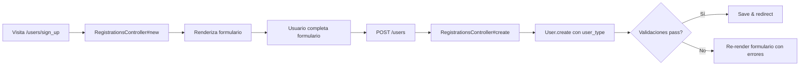

# Autenticación y Autorización

Documentación del sistema de autenticación y autorización en NEXO POS.

---

## 🔐 Autenticación

### Devise

NEXO POS utiliza **Devise** como framework de autenticación, complementado con **devise-security** para funcionalidades de seguridad adicionales.

### Módulos Configurados

```ruby
# app/models/user.rb
devise :database_authenticatable, :registerable, :session_limitable,
         :recoverable, :rememberable, :validatable, :trackable
```

| Módulo | Propósito |
|--------|-----------|
| `:database_authenticatable` | Autenticación con email/contraseña |
| `:registerable` | Registro de usuarios |
| `:session_limitable` | Límite de sesiones simultáneas |
| `:recoverable` | Recuperación de contraseña |
| `:rememberable` | Recordar sesión (remember me) |
| `:validatable` | Validaciones de email y contraseña |
| `:trackable` | Tracking de sign_in_count, timestamps, IP |

### Métodos de Autenticación

```ruby
# Consultas de usuario
User.find_for_database_authentication(email: params[:email])
User.find_by(email: email.downcase)

# Autenticación
user.valid_password?(password)
user.confirm_only!  # Si usa confirmable
```

---

## 🔑 Seguridad Adicional (devise-security)

**Archivo:** `config/initializers/devise_security.rb`

Las siguientes características están **configuradas pero deshabilitadas por defecto**:

```ruby
Devise.setup do |config|
  # config.expire_password_after = false
  # config.password_complexity = { digit: 1, lower: 1, symbol: 1, upper: 1 }
  # config.password_archiving_count = 5
  # config.deny_old_passwords = false
  # config.email_validation = true
end
```

### Recomendaciones de Seguridad

1. **Complejidad de contraseña** - Requerir mayúsculas, minúsculas, números y símbolos
2. **Caducidad de contraseña** - Expirar contraseñas después de X días
3. **Archivado de contraseñas** - Mantener historial de últimas 5 contraseñas
4. **Validación de email** - Validar formato de email
5. **CAPTCHA** - Proteger formularios de registro y recuperación

---

## 👑 Control de Acceso (Roles)

### Modelo de Roles

```ruby
# app/models/system_role.rb
enum :role_type, { system: 'system', branch: 'branch' }
enum :status, { active: 'active', inactive: 'inactive', deprecated: 'deprecated' }
```

### Tipos de Roles

| Tipo | Descripción | Ejemplos |
|------|-------------|----------|
| `system` | Rol global para toda la aplicación | `super_admin`, `administrator` |
| `branch` | Rol específico por sucursal | `cashier`, `manager` |

### Uso en el Código

```ruby
# app/models/user.rb
def admin?
  system_roles.active.exists?(code: %w[super_admin administrator])
end

def role?(role_code, branch: nil)
  scope = user_roles.active.joins(:system_role)
                      .where(system_roles: { code: role_code })
  scope = scope.where(branch: branch) if branch
  scope.exists?
end
```

### Autorización en Controladores

```ruby
# Ejemplo: Restringir acceso a administradores
class Admin::ProductsController < ApplicationController
  before_action :authenticate_user!
  
  # Solo admins pueden acceder
  def index
    redirect_to root_path unless current_user.admin?
    # ...
  end
end
```

---

## 🔐 Restricciones de Seguridad

### rack-attack

**Archivo:** `config/initializers/rack_attack.rb`

```ruby
class Rack::Attack
  # Límite general: 300 requests / 5 minutos por IP
  throttle("requests by IP", limit: 300, period: 5.minutes) { |req| req.ip }

  # Límite login: 5 intentos / 60 segundos por IP+email
  throttle("login attempts", limit: 5, period: 60.seconds) do |req|
    if req.path == "/users/sign_in" && req.post?
      "#{req.ip}:#{req.params['email']}"
    end
  end

  # Límite admin: 10 requests / 1 minuto para rutas /admin
  throttle("admin abuse", limit: 10, period: 1.minute) do |req|
    req.path.include?("admin") ? req.ip : nil
  end
end
```

---

## 🛡️ Autorización con Pundit

### Estado

**Pundit está integrado pero los policies no están implementados.**

```ruby
# Gemfile
gem 'pundit'
```

### Configuración

```ruby
# app/controllers/application_controller.rb
class ApplicationController < ActionController::Base
  # include Pundit (si estuviera habilitado)
end
```

### Recomendación

Implementar policies específicas para:
- `ProductPolicy`
- `CategoryPolicy`
- `LanguagePolicy`
- `UserPolicy`

---

## 👤 Modelo User Detallado

### Attributes

| Campo | Tipo | Descripción |
|-------|------|-------------|
| `email` | string | Email único (login) |
| `encrypted_password` | string | Password encriptada |
| `username` | string | Nombre de usuario opcional |
| `user_type` | enum | employee/customer/supplier |
| `status` | enum | active/suspended/blocked/deleted |
| `theme` | string | Tema de UI (material-red, etc.) |
| `language_id` | bigint | Idioma preferido |
| `sidebar_collapsed` | boolean | Estado sidebar |
| `session_expires_at` | datetime | Expiración de sesión |

### Session Tracking (Devise :trackable)

```ruby
# Métodos automáticos
current_sign_in_at   # Última sesión
last_sign_in_at      # Sesión anterior
current_sign_in_ip   # IP actual
last_sign_in_ip      # IP anterior
sign_in_count        # Contador de sesiones
```

---

## 🔐 Seguridad de Sesiones

### Cookie Segura

```ruby
# app/controllers/application_controller.rb
def set_action_cable_user_id_cookie
  return unless user_signed_in?
  return if cookies.signed[:user_id] == current_user.id

  cookies.signed[:user_id] = {
    value: current_user.id,
    httponly: true,
    same_site: :lax
  }
end
```

### Límite de Sesiones (`session_limitable`)

```ruby
# Configuración Devise
# config/initializers/devise.rb
config.session_limitable = true
```

---

## 🔐 Credenciales

### Rails Credentials

```text
config/
├── credentials.yml.enc  # Credenciales encriptadas
└── master.key           # Clave maestra (NO subir a git)
```

**Variables comunes a almacenar:**
- `secret_key_base` - Rails secret
- `devise.secret_key` - Devise signing key
- `aws.access_key_id` / `aws.secret_access_key` - Si usa S3
- `smtp.*` - Configuración SMTP

---

## 🔓 Flujo de Registro



---

## 🔓 Flujo de Login

```mermaid
flowchart LR
    A[Visita /users/sign_in] --> B[SessionsController#new]
    B --> C[Renderiza formulario]
    C --> D[Usuario ingresa credenciales]
    D --> E[POST /users/sign_in]
    E --> F[SessionsController#create]
    F --> G[authenticate_user!]
    G --> H{Credentials validas?}
    H -->|Sí| I[sign_in(user)]
    I --> J[Set session cookie]
    J --> K[Redirect to dashboard]
    H -->|No| L[Re-render con error]
```

---

## 🚪 Flujo de Logout

```mermaid
flowchart LR
    A[Click "Cerrar sesión"] --> B[signed_out_from_user!]
    B --> C[Devise sign_out]
    C --> D[Clear session]
    D --> E[Redirect to login]
```

---

## 📋 Resumen de Seguridad

| Característica | Estado | Implementación |
|----------------|--------|----------------|
| Email + Password | ✅ | Devise |
| Session Tracking | ✅ | Devise :trackable |
| Session Limit | ✅ | Devise :session_limitable |
| Password Recovery | ✅ | Devise :recoverable |
| Remember Me | ✅ | Devise :rememberable |
| Confirmable | ❌ | No implementado |
| Lockable | ❌ | Comentado en config |
| Timeoutable | ❌ | No implementado |
| Omniauth | ❌ | Prepara pero no activo |
| Rate Limiting | ✅ | rack-attack |
| CSRF Protection | ✅ | Rails por defecto |
| Secure Headers | ✅ | secure_headers gem |
| Paranoia (Soft Delete) | ✅ | Paranoia gem |

---

## 🧪 Pruebas de Autenticación

```ruby
# spec/models/user_spec.rb
describe User do
  describe '.admin?' do
    it 'returns true for super_admin' do
      user = create(:user)
      user.system_roles.create!(system_role: create(:system_role, code: 'super_admin'))
      expect(user.admin?).to be true
    end
  end

  describe '#role?' do
    it 'checks if user has specific role' do
      user = create(:user)
      role = create(:system_role, code: 'administrator')
      user.user_roles.create!(system_role: role)
      expect(user.role?('administrator')).to be true
    end
  end
end
```

---

## 🚨 Buenas Prácticas

1. **Usar HTTPS** en producción
2. **Configurar secure_headers** apropiadamente
3. **Habilitar devise-security** con configuración adecuada
4. **Implementar Pundit** para autorización granular
5. **Usar confirmable** para verificación de email
6. **Configurar lockable** para proteger contra fuerza bruta