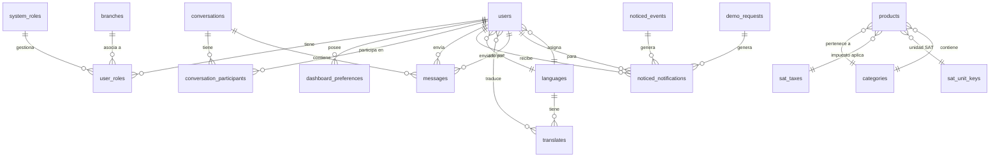

# Base de Datos

Documentación del esquema de base de datos de NEXO POS.

---

## 🗄️ Diagrama Entidad-Relación



---

## 📊 Resumen de Tablas

### Tablas Principales

| Tabla | Registros | Descripción |
|-------|-----------|-------------|
| `users` | - | Usuarios del sistema |
| `products` | - | Catálogo de productos |
| `categories` | - | Categorías de productos |
| `languages` | - | Configuración multi-idioma |
| `system_roles` | - | Roles del sistema |
| `user_roles` | - | Asociación User-Role |
| `branches` | - | Sucursales |
| `dashboard_preferences` | - | Preferencias UI |

### Tablas de Sistema

| Tabla | Registro | Propósito |
|-------|----------|-----------|
| `active_storage_*` | - | Archivos adjuntos |
| `noticed_events` | - | Eventos de notificaciones |
| `noticed_notifications` | - | Notificaciones |
| `conversations` | - | Chat entre usuarios |
| `messages` | - | Mensajes del chat |
| `translates` | - | Traducciones dinámicas |
| `demo_requests` | - | Solicitudes de demo |

### Tablas SAT (México)

| Tabla | Clave Primaria | Propósito |
|-------|----------------|-----------|
| `sat_taxes` | code | Impuestos SAT |
| `sat_unit_keys` | code | Claves unidad SAT |
| `sat_bank` | code | Bancos SAT |
| `sat_currency` | code | Monedas SAT |
| `sat_fiscal_regime` | code | Regímenes fiscales |
| `sat_payment_method` | code | Métodos de pago SAT |
| `sat_payment_method_type` | code | Tipos de pago SAT |
| `sat_month` | code | Meses SAT |

---

## 🏗️ Detalle de Modelos Principales

### Modelo `User`

**Tabla:** `users`

```ruby
create_table "users", force: :cascade do |t|
  t.datetime "created_at", null: false
  t.string "current_session_token"
  t.datetime "current_sign_in_at"
  t.string "current_sign_in_ip"
  t.datetime "deleted_at", precision: nil
  t.string "email", default: "", null: false
  t.string "encrypted_password", default: "", null: false
  t.integer "failed_attempts", default: 0, null: false
  t.bigint "language_id"
  t.datetime "last_sign_in_at"
  t.string "last_sign_in_ip"
  t.string "last_sign_in_ip_country", limit: 2
  t.text "locked_Reason"
  t.datetime "locked_at"
  t.datetime "login_attempts_window_start"
  t.datetime "remember_created_at"
  t.datetime "reset_password_sent_at"
  t.string "reset_password_token"
  t.datetime "session_expires_at"
  t.datetime "session_revoked_at"
  t.boolean "sidebar_collapsed", default: false, null: false
  t.integer "sign_in_count", default: 0, null: false
  t.string "status", default: "active", null: false
  t.string "theme", limit: 50, default: "theme-material-red", null: false
  t.string "unique_session_id"
  t.string "unlock_token"
  t.datetime "updated_at", null: false
  t.string "user_type", null: false
  t.string "username"
end
```

**Índices clave:**
- `idx_users_email` - Email único
- `index_users_on_status` - Filtrado por estado activo
- `index_users_on_language_id` - Relación con Language

**Asociaciones:**
```ruby
belongs_to :language, optional: true
has_many :user_roles, dependent: :destroy
has_many :system_roles, through: :user_roles
has_many :dashboard_preferences, dependent: :destroy
has_many :conversation_participants, dependent: :destroy
has_many :conversations, through: :conversation_participants
has_many :messages, dependent: :destroy
```

---

### Modelo `Product`

**Tabla:** `products`

```ruby
create_table "products", force: :cascade do |t|
  t.string "barcode"
  t.bigint "category_id"
  t.string "code", null: false
  t.decimal "cost", precision: 12, scale: 2, default: "0.0", null: false
  t.datetime "created_at", null: false
  t.datetime "deleted_at"
  t.text "description"
  t.boolean "featured", default: false
  t.string "image_url"
  t.decimal "max_stock", precision: 10, scale: 3
  t.decimal "min_stock", precision: 10, scale: 3, default: "0.0", null: false
  t.string "name", null: false
  t.integer "position", default: 0
  t.decimal "price", precision: 12, scale: 2, default: "0.0", null: false
  t.bigint "sat_tax_id"
  t.bigint "sat_unit_key_id"
  t.string "sku"
  t.string "slug"
  t.string "status", default: "active", null: false
  t.decimal "stock", precision: 10, scale: 3, default: "0.0", null: false
  t.datetime "updated_at", null: false
  t.integer "view_count", default: 0
end
```

**Índices clave:**
- `index_products_on_code` - Código único
- `index_products_on_sku` - SKU único
- `index_products_on_barcode` - Búsqueda por código de barras
- `index_products_on_category_id` - Relación con categoría
- `index_products_on_deleted_at` - Soft delete scope

**Asociaciones:**
```ruby
belongs_to :category, optional: true
belongs_to :sat_unit_key, optional: true
belongs_to :sat_tax, optional: true
has_one_attached :image
```

**Scopes:**
```ruby
scope :not_deleted, -> { where(deleted_at: nil) }
scope :available, -> { where(status: :active) }
scope :with_category, -> { includes(:category) }
scope :featured, -> { where(featured: true) }
scope :by_slug, ->(slug) { where(slug: slug) }
scope :sorted_by_position, -> { order(position: :asc, name: :asc) }
```

---

### Modelo `Category`

**Tabla:** `categories`

```ruby
create_table "categories", force: :cascade do |t|
  t.string "code"
  t.datetime "created_at", null: false
  t.datetime "deleted_at", precision: nil
  t.text "description"
  t.string "name"
  t.string "status", default: "active"
  t.datetime "updated_at", null: false
end
```

**Validaciones:**
- `name` -_presencia, longitud máx 50
- `code` -_presencia, unicidad, longitud máx 20, formato alfanumérico
- `status` -_inclusión [active, inactive]

---

### Modelo `Language`

**Tabla:** `languages`

```ruby
create_table "languages", force: :cascade do |t|
  t.string "code"
  t.datetime "created_at", null: false
  t.datetime "deleted_at", precision: nil
  t.string "flag_iso"
  t.string "name"
  t.string "status"
  t.datetime "updated_at", null: false
end
```

**Asociaciones:**
```ruby
has_many :users, dependent: :nullify
has_many :translates, dependent: :destroy
```

---

### Modelo `SystemRole`

**Tabla:** `system_roles`

```ruby
create_table "system_roles", force: :cascade do |t|
  t.string "code", limit: 50, null: false
  t.datetime "created_at", null: false
  t.datetime "deleted_at", precision: nil
  t.string "description"
  t.string "name", limit: 50, null: false
  t.string "role_type", limit: 20, null: false  # system / branch
  t.string "status", limit: 20, default: "active", null: false
  t.datetime "updated_at", null: false
end
```

**Enums:**
```ruby
enum :role_type, { system: 'system', branch: 'branch' }
enum :status, { active: 'active', inactive: 'inactive', deprecated: 'deprecated' }
```

---

### Modelo `UserRole` (Join Table)

**Tabla:** `user_roles`

```ruby
create_table "user_roles", force: :cascade do |t|
  t.bigint "branch_id"
  t.datetime "created_at", null: false
  t.datetime "deleted_at", precision: nil
  t.bigint "system_role_id", null: false
  t.datetime "updated_at", null: false
  t.bigint "user_id", null: false
end
```

**Validaciones:**
- Único por combinación `user_id + system_role_id + branch_id`
- Branch role requiere branch
- System role no puede tener branch

---

## 🔍 Modelos SAT (México)

### Modelo `SatTax`

**Tabla:** `sat_taxes`

```ruby
t.string "code", null: false
t.string "name", null: false
t.string "tax_type", default: "transfer", null: false  # transfer / withheld
t.string "factor_type", default: "rate", null: false  # rate / quota / exempt
t.string "applies_to"  # product / service / both
t.boolean "is_retainable", default: false
t.boolean "is_transferrable", default: true
t.integer "priority", default: 1
t.decimal "rate"  # porcentaje
```

---

### Modelo `SatUnitKey`

**Tabla:** `sat_unit_keys`

```ruby
t.string "code", limit: 5, null: false
t.string "description", limit: 255, null: false
t.string "symbol", limit: 10
```

---

## 📈 Relaciones Clave

```ruby
# Producto -> Categoría
product.category  # => Category

# Producto -> Impuesto SAT
product.sat_tax   # => SatTax

# Usuario -> Role
user.system_roles # => ActiveRecord::Associations::CollectionProxy

# Usuario -> Preferencias Dashboard
user.dashboard_preferences # => ActiveRecord::Associations::CollectionProxy

# Usuario -> Idioma
user.language # => Language

# Conversación <-> Mensajes
conversation.messages # => ActiveRecord::Associations::CollectionProxy
message.conversation # => Conversation
```

---

## 🔄 Soft Delete (Paranoia)

Los siguientes modelos usan `paranoia` para soft delete:

```ruby
# Modelos con paranoia
User
Product
Category
Language
SystemRole
Branch
Message
Conversation
ConversationParticipant
DashboardPreference
DemoRequest
Notice::Event
Notice::Notification
```

**Al usar `destroy`, se establece `deleted_at` en lugar de borrar el registro.**

**Scopes aplicados:**
```ruby
scope :not_deleted, -> { where(deleted_at: nil) }
```

---

## 🔐 Restricciones y Check Constraints

```sql
-- Check de rango latitude/longitude
CHECK (latitude >= -90 AND latitude <= 90 OR latitude IS NULL)
CHECK (longitude >= -180 AND longitude <= 180 OR longitude IS NULL)

-- Check de códigos SAT
CHECK (code ~ '^[0-9]{3}$'::text)  -- Banks
CHECK (code ~ '^[A-Z]{3}$'::text)  -- Currencies

-- Check de meses SAT
CHECK (code::text ~ '^(0[1-9]|1[0-2])$'::text)

-- Check de estado de usuarios
CHECK (status::text = ANY(ARRAY['active', 'blocked', 'suspended', 'deleted']))

-- Check de tipo de usuario
CHECK (user_type::text = ANY(ARRAY['employee', 'customer', 'supplier']))
```

---

## 📚 Referencias Útiles

- [PostgreSQL Documentation](https://www.postgresql.org/docs/)
- [Rails ActiveRecord Associations](https://guides.rubyonrails.org/association_basics.html)
- [Paranoia Gem](https://github.com/thoughtless/paranoia)