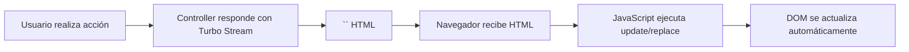

# Frontend

Documentación del stack frontend de NEXO POS.

---

## 🧱 Stack Tecnológico

| Tecnología | Versión | Propósito |
|------------|---------|-----------|
| **Tailwind CSS** | 4.2.2 | Framework CSS utility-first |
| **Stimulus** | 3.2.2 | Framework JavaScript declarativo |
| **Turbo** | 8.0.23 | navegación y actualizaciones en tiempo real |
| **SweetAlert2** | 11.26.25 | Notificaciones modales |
| **GridStack** | 13.3.0 | Dashboard widgets |
| **esbuild** | 0.28.0 | Bundler y build tool |

---

## 📁 Estructura Frontend

### JavaScript

```text
app/javascript/
├── application.js           # Entry point principal
├── admin/
│   └── dashboard.js         # Lógica del dashboard admin
└── controllers/
    ├── application.js       # Registro Stimulus base
    ├── index.js             # Manifest Stimulus (auto-generated)
    │
    # Controllers principales
    ├── products_controller.js
    ├── products_search_controller.js
    ├── categories_controller.js
    ├── categories_search_controller.js
    ├── languages_controller.js
    ├── language_selector_controller.js
    │
    # UI Controllers
    ├── modal_controller.js
    ├── navbar_controller.js
    ├── swal_confirm_controller.js
    ├── swal_flash_controller.js
    ├── clock_controller.js
    │
    # Social/Chat
    ├── conversation_form_controller.js
    ├── conversation_messages_controller.js
    │
    # Dashboard
    ├── dashboard_controller.js
    │
    # Utilities
    ├── online_users_controller.js
    └── terminal_controller.js
```

### Stylesheets

```text
app/assets/stylesheets/
├── application.css         # Layout básico
├── application.tailwind.css # Tailwind principal
├── admin_dashboard.css
├── fonts.css
├── gridstack.css
└── components/
    └── *.css
```

---

## 🎮 Controllers Stimulus

### Controllers Principales

#### `products_controller.js`

**Elemento:** `data-controller="products"`

**Funcionalidad:**
- Gestión del formulario de productos
- Validación de campos
- Envío de formularios

#### `products_search_controller.js`

**Elemento:** `data-controller="products-search"`

**Acciones:**
- `input->products-search#debouncedSubmit` - Búsqueda con debounce

#### `modal_controller.js`

**Elemento:** `data-controller="modal"`

**Acciones:**
- `keydown.esc@window->modal#close` - Cerrar con ESC
- `click->modal#background` - Cerrar al hacer click en backdrop

**Uso en vistas:**
```erb
<%= turbo_frame_tag "category_modal",
      data: {
        controller: "modal",
        action: "turbo:frame-load->modal#frameLoaded keydown.esc@window->modal#close click->modal#background"
      } %>
```

#### `swal_flash_controller.js`

**Elemento:** `data-controller="swal-flash"`

**Propiedades:**
- `data-swal-flash-message-value` - Mensaje a mostrar
- `data-swal-flash-icon-value` - Ícono (success, error, warning, info)

**Uso:**
```erb
<div data-controller="swal-flash"
     data-swal-flash-message-value="<%= flash[:swal_message] %>"
     data-swal-flash-icon-value="success"
     class="hidden"></div>
```

#### `swal_confirm_controller.js`

**Elemento:** `data-controller="swal-confirm"`

**Uso para confirmaciones:**
```erb
<button data-controller="swal-confirm"
        data-swal-confirm-message="¿Estás seguro?"
        data-swal-confirm-confirm="delete"
        data-swal-confirm-action="<%= delete_product_path(product) %>">
  Eliminar
</button>
```

#### `language_selector_controller.js`

**Elemento:** `data-controller="language-selector"`

**Funcionalidad:**
- Selector de idioma
- Actualización en tiempo real vía Turbo Stream

#### `dashboard_controller.js`

**Elemento:** `data-controller="dashboard"`

**Funcionalidad:**
- GridStack para widgets
- Drag and drop de widgets
- Persistencia de posición

---

## 🎨 Sistema de Estilos

### Tailwind Configuration

```text
app/assets/stylesheets/application.tailwind.css
```

**Olviate personalizados:**
- Colores: `blue-600`, `emerald-500`, `rose-500`, `slate-900`, etc.
- Tipografía: Font 'Jakarta' (Inter)
- Espaciado: Sistema estándar Tailwind
- Dark mode: Siempre activo (dark theme)

### Clases Principales por Sección

#### Layout Admin

```html
<body class="min-h-full bg-slate-100 text-slate-900 antialiased">
  <div class="flex min-h-screen">
    <!-- Sidebar -->
    <!-- Main content -->
  </div>
</body>
```

#### Cards y Widgets

```html
<div class="rounded-xl bg-white shadow-sm border border-slate-200">
  <!-- Contenido -->
</div>
```

#### Botones

```html
<!-- Primary -->
class="inline-flex items-center gap-2 rounded-lg bg-blue-600 px-4 py-2.5 text-sm font-semibold text-white shadow-sm transition hover:bg-blue-700"

<!-- Secondary -->
class="inline-flex items-center gap-2 rounded-lg bg-slate-100 px-3 py-1.5 text-sm font-medium text-slate-700 hover:bg-slate-200"
```

#### Inputs

```html
<input class="w-full rounded-lg border border-slate-300 px-3 py-1.5 text-sm text-slate-700 placeholder-slate-400 focus:border-blue-500 focus:outline-none focus:ring-1 focus:ring-blue-500">
```

---

## 📐 Layouts Principales

### `application.html.erb` (Público)

```erb+html
<!DOCTYPE html>
<html lang="es" class="h-full scroll-smooth">
  <head>
    <title><%= content_for?(:title) ? yield(:title) : "Nexo POS | Sistema de Punto de Venta" %></title>
    <%= csrf_meta_tags %>
    <%= stylesheet_link_tag :application, "data-turbo-track": "reload" %>
    <%= javascript_include_tag "application", "data-turbo-track": "reload", type: "module" %>
  </head>
  <body class="bg-slate-950 text-white antialiased">
    <main>
      <%= yield %>
    </main>
  </body>
</html>
```

### `admin_dashboard.html.erb` (Admin)

**Características:**
- Sidebar colapsable
- Topbar con notificaciones
- Breadcrumbs
- Flash con SweetAlert2
- Modals para idioma y categoría

---

## 🧩 Componentes ViewComponent

### Ubicación

```text
app/components/
├── admin/
│   ├── kpi_card_component.rb       # Tarjeta de KPI
│   ├── low_stock_component.rb      # Alertas bajo stock
│   ├── quick_actions_component.rb  # Acciones rápidas
│   ├── recent_sales_component.rb   # Ventas recientes
│   └── sales_chart_component.rb    # Gráfico de ventas
│
├── landing/
│   ├── hero_component.rb
│   ├── features_component.rb
│   ├── testimonial_component.rb
│   └── pricing_card_component.rb
│
└── ui/
    ├── icon_component.rb
    ├── button_component.rb
    └── card_component.rb
```

### Ejemplo: KPI Card Component

```ruby
# app/components/admin/kpi_card_component.rb
# frozen_string_literal: true

module Admin
  class KpiCardComponent < ViewComponent::Base
    def initialize(title:, value:, change: nil, status: nil, icon_name: nil)
      @title = title
      @value = value
      @change = change
      @status = status
      @icon_name = icon_name
    end

    private
    attr_reader :title, :value, :change, :status, :icon_name
    delegate :icon, to: :helpers
  end
end
```

---

## 🔄 Flujo de Actualización en Tiempo Real

NEXO POS utiliza **Turbo Streams** para actualizaciones sin recargar página:



### Ejemplo: Actualización de productos

```ruby
# Controller
def broadcast_products_update
  html = render_to_string(partial: 'admin/products/list',
                          locals: { products: @products })
  Turbo::StreamsChannel.broadcast_update_to('products_catalog',
                                            target: 'admin_products_list', html: html)
end
```

```erb
<!-- Vista -->
<%= turbo_frame_tag "admin_products_list" do %>
  <%= render "list", products: @products %>
<% end %>
```

---

## 📱 Responsividad

El sistema está diseñado para dispositivos móviles:

```html
<!-- Responsive grid -->
<div class="flex min-h-screen">
  <!-- Mobile: sidebar oculto -->
  <div class="flex-1">
    <!-- Content -->
  </div>
</div>

<!-- Breakpoints Tailwind -->
<!-- sm: 640px -->
<!-- md: 768px -->
<!-- lg: 1024px -->
<!-- xl: 1280px -->
<!-- 2xl: 1536px -->
```

---

## 🔤 Iconos

Usa el gem `rails_icons`:

```erb
<%= icon("shopping-bag", class: "size-5") %>
<%= icon("chart-pie", variant: :solid) %>
```

**Iconos más usados:**
- `shopping-bag` - Logo de la app
- `chart-pie` - Dashboard
- `shopping-cart` - Ventas
- `cube` - Productos
- `building-storefront` - Sucursales
- `users` - Clientes
- `truck` - Proveedores
- `user` - Empleados