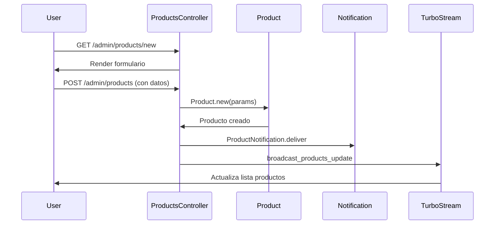
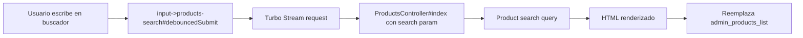

# Módulos del Sistema

Documentación de los módulos funcionales de NEXO POS.

---

## 📦 Catálogo de Módulos

| Módulo | Archivo | Estado | Descripción |
|--------|---------|--------|-------------|
| [Productos](./products.md) | products.md | ✅ Implementado | Gestión del catálogo de productos |
| [Categorías](./categories.md) | categories.md | ✅ Implementado | Organización de productos |
| [Idiomas](./languages.md) | languages.md | ✅ Implementado | Configuración multi-idioma |
| [Dashboard](./dashboard.md) | dashboard.md | ✅ Implementado | Panel de administración |
| [Usuarios y Roles](./users.md) | users.md | ✅ Implementado | Administración de usuarios |
| [Comunicaciones](./communications.md) | communications.md | ✅ Implementado | Chat en tiempo real |
| [Notificaciones](./notifications.md) | notifications.md | ✅ Implementado | Notificaciones instantáneas |
| [Solicitudes Demo](./demo-requests.md) | demo-requests.md | ✅ Implementado | Captura de leads |

---

## 📚 Índice de Módulos

### [Productos](modules/products.md)

**Controlador:** `Admin::ProductsController`

**Modelo:** `Product`

**Características:**
- CRUD completo con búsqueda
- Soft delete (paranoia)
- Actualización en tiempo real vía Turbo Streams
- Contador de vistas
- Integración con categoría, SAT tax y SAT unit key

**Endpoints principales:**
```
GET    /admin/products
POST   /admin/products
GET    /admin/products/:id
PATCH  /admin/products/:id
DELETE /admin/products/:id
```

---

### [Categorías](modules/categories.md)

**Controlador:** `Admin::CategoriesController`

**Modelo:** `Category`

**Características:**
- Organización jerárquica de productos
- Códigos únicos
- Estado activo/inactivo

**Endpoints principales:**
```
GET    /admin/categories
POST   /admin/categories
GET    /admin/categories/:id/edit
PATCH  /admin/categories/:id
DELETE /admin/categories/:id
```

---

### [Idiomas](modules/languages.md)

**Controlador:** `Admin::LanguagesController`

**Modelo:** `Language`

**Características:**
- Gestión de idiomas del sistema
- Bandera ISO para visualización
- Selector de idioma en tiempo real

**Endpoints principales:**
```
GET    /admin/languages
POST   /admin/languages
GET    /admin/languages/:id/edit
PATCH  /admin/languages/:id
DELETE /admin/languages/:id
GET    /admin/languages/content  # API para selector
```

---

### [Dashboard](modules/dashboard.md)

**Controlador:** `Admin::DashboardController`

**Modelo:** `DashboardPreference`

**Características:**
- Widgets personalizables con GridStack
- Persistencia de posición y tamaño
- Actualización vía AJAX

**Endpoints principales:**
```
GET  /admin/dashboard
POST /admin/dashboard/preferences
```

---

### [Usuarios y Roles](modules/users.md)

**Controladores:** `SystemRolesController`

**Modelos:** `User`, `SystemRole`, `UserRole`, `Branch`

**Características:**
- Autenticación con Devise
- Roles globales y por sucursal
- Session tracking y límite de sesiones
- Preferencias de tema y sidebar

**Enums:**
```ruby
user_type: { employee: 'employee', customer: 'customer', supplier: 'supplier' }
status: { active: 'active', suspended: 'suspended', blocked: 'blocked', deleted: 'deleted' }
role_type: { system: 'system', branch: 'branch' }
```

---

### [Comunicaciones](modules/communications.md)

**Controladores:** `ConversationsController`, `MessagesController`

**Modelos:** `Conversation`, `Message`, `ConversationParticipant`

**Características:**
- Chat en tiempo real con ActionCable
- Turbo Streams para actualización
- Mensajes persistentes

**Endpoints principales:**
```
GET    /conversations/:id
POST   /conversations
POST   /conversations/:id/messages
```

---

### [Notificaciones](modules/notifications.md)

**Gem:** `noticed`

**Modelos de Notificación:**
- `ProductNotification`
- `CategoryNotification`
- `LanguageNotification`

**Características:**
- Notificaciones en tiempo real
- Badges en la barra de navegación
- Lista de notificaciones
- Marcar como leídas

**Endpoints:**
```
POST /notifications/mark_all_read
```

---

### [Solicitudes Demo](modules/demo-requests.md)

**Controlador:** `DemoRequestsController`

**Modelo:** `DemoRequest`

**Características:**
- Formulario de captura de leads
- Notificaciones automáticas
- Estado de seguimiento

---

## ⚠️ Módulos NO Implementados

Los siguientes items aparecen en el **sidebar** pero **NO tienen controlador ni funcionalidad**:

| Ítem Sidebar | Estado | Comentario |
|--------------|--------|------------|
| Nueva Venta | ❌ | Sin controlador de ventas |
| Historial de Ventas | ❌ | Sin histórico de ventas |
| Devoluciones | ❌ | Sin gestión de devoluciones |
| Corte de Caja | ❌ | Sin módulo de caja |
| Consultar Caja | ❌ | Sin vista de caja |
| Clientes | ❌ | No hay modelo Customer |
| Proveedores | ❌ | No hay modelo Supplier |
| Movimientos | ❌ | Sin gestión de movimientos |
| Ajustes | ❌ | Sin ajustes de inventario |
| Kardex | ❌ | Sin control de kardex |
| Por Sucursal | ❌ | Sin filtrado por sucursal |
| Reportes | ❌ | Sin controlador de reportes |
| Roles | ✅ | SystemRolesController |
| Permisos | ❌ | Sin sistema de permisos granular |
| Sucursales | ❌ | Sin CRUD de branches (solo sidebar) |
| Impuestos | ❌ | Sin gestión de impuestos |

---

## 🔄 Flujos de Trabajo Comunes

### Crear Producto



### Búsqueda de Productos

