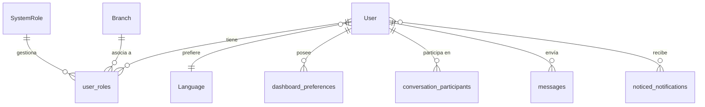

# Usuarios y Roles

Gestión de usuarios, roles y permisos en NEXO POS.

---

## 👤 Modelo User

**Ubicación:** `app/models/user.rb`

### Atributos

| Campo | Tipo | Requerido | Descripción |
|-------|------|-----------|-------------|
| `email` | string | ✅ | Email único (login) |
| `encrypted_password` | string | ✅ | Password encriptada |
| `username` | string | ❌ | Nombre de usuario opcional |
| `user_type` | string | ✅ | employee/customer/supplier |
| `status` | string | ✅ | active/suspended/blocked/deleted |
| `theme` | string | ✅ | Tema UI |
| `sidebar_collapsed` | boolean | ✅ | Estado sidebar |
| `language_id` | bigint | ❌ | Idioma preferido |
| `session_expires_at` | datetime | ❌ | Expiración de sesión |

### Enums

```ruby
enum :user_type, {
  employee: 'employee',
  customer: 'customer',
  supplier: 'supplier'
}

enum :status, {
  active: 'active',
  suspended: 'suspended',
  blocked: 'blocked',
  deleted: 'deleted'
}
```

---

## 👑 Modelo SystemRole

**Ubicación:** `app/models/system_role.rb`

### Atributos

| Campo | Tipo | Descripción |
|-------|------|-------------|
| `code` | string | Código único del rol |
| `name` | string | Nombre del rol |
| `role_type` | string | system/branch |
| `status` | string | active/inactive/deprecated |
| `description` | text | Descripción |

### Enums

```ruby
enum :role_type, { system: 'system', branch: 'branch' }
enum :status, { active: 'active', inactive: 'inactive', deprecated: 'deprecated' }
```

### Roles por Defecto

| Código | Nombre | Tipo | Uso |
|--------|--------|------|-----|
| `administrator` | Administrator | system | Acceso total |
| `super_admin` | Super Admin | system | Acceso total + gestión roles |
| `cashier` | Cashier | branch | Ventas por sucursal |
| `manager` | Manager | branch | Gestión de sucursal |

---

## 🔗 Modelo UserRole (Join Table)

**Ubicación:** `app/models/user_role.rb`

### Validaciones

```ruby
validate :branch_role_requires_branch
validate :global_role_cannot_have_branch

validates :user_id, uniqueness: {
  scope: %i[system_role_id branch_id],
  conditions: -> { where(deleted_at: nil) }
}
```

### Restricciones

- **Branch role** requiere `branch_id`
- **System role** no puede tener `branch_id`

---

## 🔐 Autenticación con Devise

### Módulos Configurados

```ruby
devise :database_authenticatable, :registerable, :session_limitable,
         :recoverable, :rememberable, :validatable, :trackable
```

### Métodos de Autorización

```ruby
# app/models/user.rb
def admin?
  system_roles.active.exists?(code: %w[super_admin administrator])
end

def role?(role_code, branch: nil)
  scope = user_roles.active.joins(:system_role)
                      .where(system_roles: { code: role_code })
  scope = scope.where(branch: branch) if branch
  scope.exists?
end
```

---

## 🔐 Métodos de Instancia

| Método | Descripción |
|--------|-------------|
| `initials` | Devuelve iniciales del usuario |
| `display_name` | Nombre para mostrar (username o initials) |
| `online?` | Verifica si usuario está online |
| `broadcast_notifications_refresh` | Actualiza notificaciones en tiempo real |

---

## 🌐 Relaciones



---

## 🛠️ Rutas de Usuarios

### Devise (Authentication)

| Método | Endpoint | Acción |
|--------|----------|--------|
| POST | `/users` | Registro |
| DELETE | `/users/sign_out` | Logout |
| PUT | `/users` | Actualizar password |
| GET | `/users/edit` | Formulario editar |

### System Roles

| Método | Endpoint | Acción |
|--------|----------|--------|
| GET | `/system_roles` | Lista roles |
| GET | `/system_roles/new` | Formulario |
| POST | `/system_roles` | Crear |
| GET | `/system_roles/:id/edit` | Editar |
| PATCH | `/system_roles/:id` | Actualizar |
| DELETE | `/system_roles/:id` | Eliminar |

---

## 🎨 Dashboard Preferences

**Modelo:** `DashboardPreference`

### Atributos

| Campo | Tipo | Descripción |
|-------|------|-------------|
| `user_id` | bigint | Usuario propietario |
| `widget_id` | string | ID del widget |
| `grid_type` | string | Tipo de grid |
| `position_x` | integer | Posición X |
| `position_y` | integer | Posición Y |
| `width` | integer | Ancho |
| `height` | integer | Alto |

---

## 🧪 Tests

```ruby
# spec/models/user_spec.rb
describe User do
  describe '#admin?' do
    it 'returns true for administrator role' do
      user = create(:user)
      admin_role = create(:system_role, code: 'administrator')
      user.user_roles.create!(system_role: admin_role)
      expect(user.admin?).to be true
    end

    it 'returns false for regular employee' do
      user = create(:user, :employee)
      expect(user.admin?).to be false
    end
  end

  describe '#role?' do
    let(:user) { create(:user) }
    let(:cashier_role) { create(:system_role, code: 'cashier') }

    before { user.user_roles.create!(system_role: cashier_role) }

    it 'returns true when user has role' do
      expect(user.role?('cashier')).to be true
    end

    it 'returns false when user lacks role' do
      expect(user.role?('manager')).to be false
    end
  end
end
```